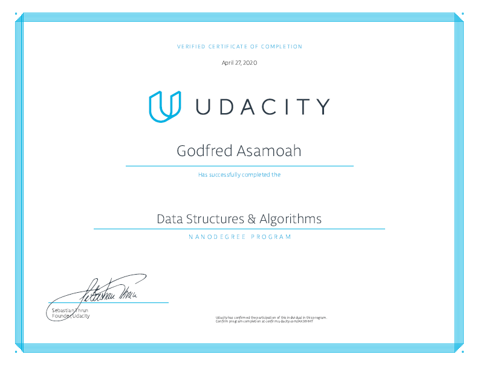

# Data Structures & Algorithms Nanodegree Projects

This repository contains my projects for Udacity's [Data Structures & Algorithms Nanodegree Program](https://www.udacity.com/course/data-structures-and-algorithms-nanodegree--nd256).

## Projects

- [1 - Unscamble Computer Science Problems](/1-unscramble-cs): Deconstruct a series of open-ended problems into smaller components(e.g. inputs, outputs, series of functions).

- [2 - Show Me the Data Structures](/2-data-structures): Solve a series of open-ended practice problems. Hone your skills to identify and implement appropriate data structures and corresponding methods that meet given constraints.

- [3 - Problems vs. Algorithms](/3-problems-algorithms): A series of real-world open ended problems which train you to apply suitable data structures and algorithms under different context.

- [4 - Route Planner](/4-route-planner): Build a route-planning algorithm like the one used in Google Maps to calculate the shorest path between two points on a map.

## Graduation Certificate🎉🎉

[Certificate Link](https://confirm.udacity.com/AK3EHMT)
